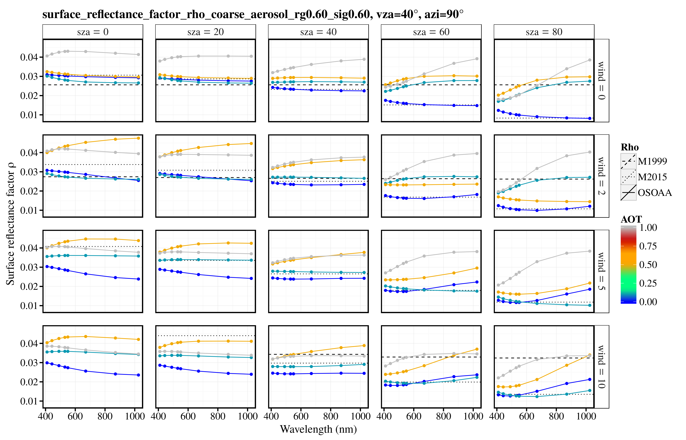

# Air-water interface reflectance factor calculator
## rho_factor package
Tools to generate and analyze the so-called surface reflection factor (rho factor) for above-water radiometry purposes



## help for visualization


### Installing

To install the package:
```
python setup.py install
```

or 

```
python setup.py install --user
```

If the installation is successful, type:
```
visu_rho
```