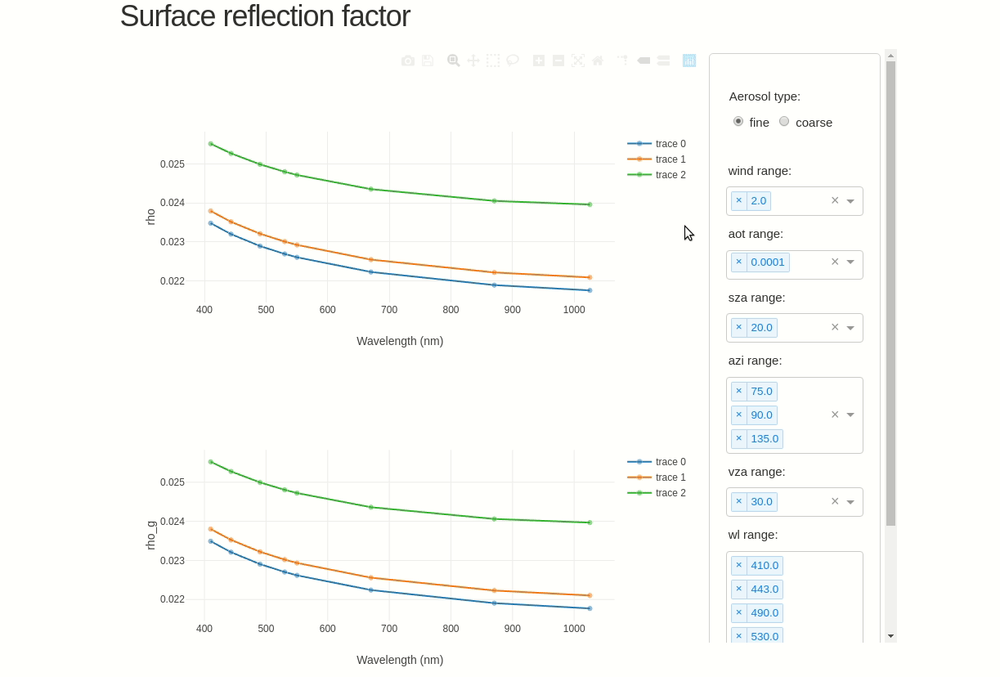

# Air-water interface reflectance factor calculator
## rho_factor package
Tools to generate and analyze the so-called surface reflection factor (rho factor) for above-water radiometry purposes


## help for visualization




### Installing

To install the package:
```
python setup.py install
```

or 

```
python setup.py install --user
```

If the installation is successful, type:
```
visu_rho
```

## Authors

* **Tristan Harmel** - *Initial work* - [contact](tristan.harmel@gmail.com)

## License

This project is licensed under the MIT License - see the [LICENSE.md](LICENSE.md) file for details

## Acknowledgments
Related scientific work has been supported by the Programme National de Télédétection Spatiale (PNTS,
http://www.insu.cnrs.fr/pnts ), grant n°PNTS-2019-13
